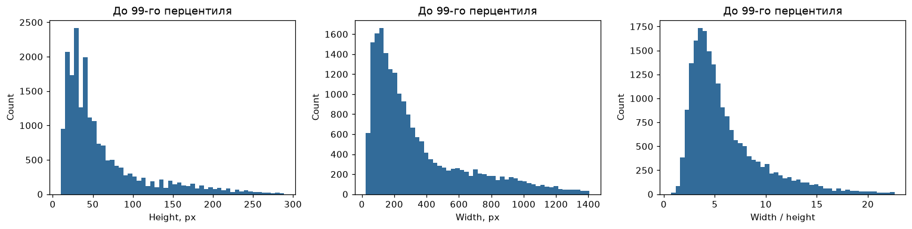

# Определение перевёрнутого текста: PP-LCNet

Решение предсказывает `p_180` — вероятность того, что текстовый бокс повёрнут на 180°.
Использована компактная **PP-LCNet_x1_0_textline_ori**, дообученная на синтетических
русских и английских текстовых строках. Полученный результат на тесте организатора:
**1 − Brier = 0.90386951**, Brier = **0.09613049**.

Основной результат — [submission.csv](submission.csv): 20 000 изображений,
ровно две колонки `image_id,p_180`. Сохранены вероятности модели, без округления до 0/1.
Краткий разбор и запуск предсказаний — [notebooks/solution.ipynb](notebooks/solution.ipynb).

## Как я пришёл к решению

**Сначала уточнил, что именно нужно предсказывать.** На вход уже подаются боксы с
текстом: искать текст и распознавать каждое слово не требуется. Нужна только
ориентация 0°/180°. Поэтому начал с готового компактного классификатора
PP-LCNet из PaddleOCR: он решает ту же задачу и соответствует ограничению на
быстрый inference. Его двухклассовую голову не нужно заменять.

**Затем проверил, достаточно ли готовых весов.** Без дообучения x0.25 и x1.0
дали почти одинаковый синтетический результат; преимущества x1.0 на этом
holdout не обнаружено. x1.0 стал проверенным тестовым baseline с баллом
0.85088864. Дальше оставил эту архитектуру, чтобы сравнить её до и после
адаптации, а не менять сразу и модель, и данные.

**Повод для fine-tune — не догадка, а срез ошибок.** У готовой x1.0 Brier
на английских строках был 0.05608, на русских — 0.15498. Особенно слабым
оказался RU-срез с буквами и цифрами: 0.32084. Гипотеза: адаптация на RU/EN
улучшит признаки ориентации на этих данных. Это не доказывает, что исходная
модель не видела русского при обучении: её исходный состав train не проверялся.

**Метки получил поворотом, а не ручной разметкой.** Из синтетических страниц
извлёк исходно читаемые строки и создал для каждой вариант на 180°.
Разделил исходные страницы до поворотов, чтобы связанные картинки не попали
одновременно в train и validation. Дообучил существующую модель, сохранив
архитектуру и официальный размер входа. Тестовый балл вырос до 0.90386951.

**В финале сохранил вероятности.** Уверенная ошибка дорого стоит по Brier.
Проверил идею порога 0.5 отдельно: на holdout она ухудшила результат, поэтому
основной `submission.csv` не округляется. OCR-распознавание, LLM/VLM и внешние
API для предсказаний не используются.

## Эксперименты и результаты

| Эксперимент | Синтетическая validation: 1 − Brier | Тест организатора: 1 − Brier |
| --- | ---: | ---: |
| PP-LCNet x0.25, без дообучения | 0.89549513 | — |
| PP-LCNet x1.0, без дообучения | 0.89493120 | 0.85088864 |
| **PP-LCNet x1.0, fine-tune RU/EN** | **0.99542934** | **0.90386951** |
| Fine-tune, затем жёсткий порог 0.5 | 0.99370005 | Не оценён |

Тестовые результаты получены от организатора и сообщены автором решения.
Сводка исходных baseline-отчётов — [reports/baseline_metrics.json](reports/baseline_metrics.json),
подробности fine-tune — [reports/validation/](reports/validation/).
Локальных тестовых меток нет. Синтетический holdout заметно проще реального теста:
высокая validation-метрика не означает такого же качества на фотографиях.
Жёсткий порог оставлен только как проверенный эксперимент: на holdout он ухудшил Brier.
ResNet-18 рассматривался, но завершённого сравнения нет, поэтому в итоговое решение не включён.

## Что дал EDA — и чего он не доказал

В [ноутбуке](notebooks/solution.ipynb) оставлен короткий EDA, а не весь черновик
исследования. На 20 000 тестовых боксах медианы ширины и высоты — 238 и 42 px;
межквартильные интервалы — 129–479.25 и 27–76 px. Это отдельные медианы двух
признаков, не обязательно размер одной существующей картинки.
Распределения вытянуты вправо: среднее плохо описывает типичный бокс.



График ограничен 99-м перцентилем только для читаемости: тестовые картинки из
хвоста не исключались. Размеры помогли понять неоднородность данных и рассмотреть
сохранение пропорций при подготовке собственного CNN. Но вариант 48×384
**не вошёл** в итоговый fine-tune. Финальный resize 160×80 взят из официального
рецепта PP-LCNet, не подобран по этим гистограммам. Параметры предобработки
не сравнивались в отдельной абляции; геометрическое покрытие не равно качеству модели.

## Обучающие данные и валидация

Источник — [NVIDIA OCR-Synthetic-Multilingual-v1](https://huggingface.co/datasets/nvidia/OCR-Synthetic-Multilingual-v1):
`ru/train/train_000.h5` и `en/train/train_000.h5`.
Извлечено по 40 000 кропов `line_bboxes`, не более трёх строк с одной страницы.
Фильтр `width / height >= 1` оставил 71 155 кропов. Это геометрический фильтр,
а не проверка истинного направления текста. Исходные PNG не удалялись.

Разбиение — один `GroupShuffleSplit` отдельно для каждого языка, seed 42,
около 15% групп в validation. Группа — `language + source_page_id`.
Это holdout, не k-fold CV. В train и validation нет общих страниц или изображений.
Тип текста используется только для анализа групп, а не для фильтрации:
буквы, цифры и смешанные строки сохранены.

- Train: 60 520 исходных кропов, 121 040 парных вариантов 0°/180°.
- Validation: 10 635 исходных кропов, 21 270 парных вариантов.
- Каждый кроп создаёт оба класса; train-manifest перемешивается с seed 42,
  validation-manifest — с seed 43. Повороты создаются **после** разбиения.

Ревизия источника `69696a1cc543ef3a0f8e9892a89c17293e915263` восстановлена из
сохранённой информации первоначальных загрузок обоих H5 и закреплена в конфиге.
Для точного повторения использованного набора предпочтительны сохранённые PNG и CSV сплитов.
Данные и тестовые картинки в Git не включены.

Сохранённые данные для повторения обучения размещаются в
[папке Google Drive](https://drive.google.com/drive/folders/1G5tqSNlCG89dKWfuCzvM4TkXhgPvkCPc?usp=sharing).
**Архив добавляет автор; на момент обновления документации его загрузка и доступ
не подтверждены.** После распаковки ожидается
`data/processed/line_crops/{ru,en}/` и CSV сплитов в этой же папке.
Подробности: [docs/data.md](docs/data.md). Для получения submission обучающие
картинки и raw H5 не нужны: достаточно тестовых картинок и сохранённых в Git весов.

## Воспроизвести submission

Нужны Python **3.12, 64-bit**, Git и выданные тестовые изображения.
Поместите картинки в `data/test/images/`; образец порядка ID уже лежит в репозитории.
Команды выполняются из корня проекта.

```bash
python -m venv .venv
# Linux/macOS:
source .venv/bin/activate
# Windows PowerShell: .\.venv\Scripts\Activate.ps1
python -m pip install paddlepaddle==3.3.0 -i https://www.paddlepaddle.org.cn/packages/stable/cpu/
python -m pip install -r requirements.txt
python src/predict.py --model-dir artifacts/model --sample sample_submission.csv --images data/test/images --output outputs/submission_reproduced.csv --device cpu --batch-size 128
```

Код использует локальные веса, сохраняет порядок ID, проверяет диапазон вероятностей
и не перезаписывает существующий CSV. Для GPU нужно отдельное окружение с
`paddlepaddle-gpu` вместо CPU-пакета; выбор карты: `--device gpu --physical-gpu-id 5`.

Исходный CSV получен на RTX A4000 с Paddle 3.3.0, batch 128. **Повторный GPU-прогон
всех 20 000 картинок в том же окружении дал побитово одинаковый CSV** (совпадает
SHA256). Проверка: [reports/reproducibility.json](reports/reproducibility.json).
Повторный полный CPU-прогон сохранил все ID и классы, но дал численные отличия:
максимум около `2.0e-5` по `p_180`. Побитовое совпадение CPU/GPU не обещается.
В конце ноутбука есть сравнение нового CSV с отправленным, включая SHA256.
Сохранённый результат не заменяется повторным прогоном.

Для GPU-повторения вместо CPU-пакета установите `paddlepaddle-gpu==3.3.0`
для CUDA 12.6, как в [инструкции обучения](docs/training.md), и используйте
свободную разрешённую карту:

```bash
python src/predict.py --model-dir artifacts/model --sample sample_submission.csv --images data/test/images --output outputs/submission_gpu_reproduced.csv --device gpu --physical-gpu-id 5 --batch-size 128
```

Номер 5 относится к использованному серверу, а не обязателен для другого компьютера.
Точное совпадение подтверждено для исходного окружения, не для любого драйвера и GPU.

Важная деталь: используется `topk=2`, а вероятность 180° выбирается по
`label_names` текущей картинки. В использованной версии PaddleX поле `class_ids`
могло содержать матрицу всего батча; его разворачивание приводило к неверным вероятностям.
Предобработка берётся из `inference.yml`: RGB, resize **160×80 (ширина×высота)**,
ImageNet mean/std. Исследованный в EDA размер 48×384 в итоговой модели не используется.

## Веса и файлы

```text
notebooks/solution.ipynb        краткий отчёт и управляемый запуск предсказаний
src/predict.py                 предсказания и оценка размеченной validation
src/train.py                   check / train / evaluate / export
src/prepare_data.py            download / extract / filter / split
src/build_orientation_dataset.py  парные 0°/180° картинки и manifests
configs/                       параметры подготовки и обучения
artifacts/model/               готовый граф, параметры и предобработка
artifacts/checkpoint/           дообучаемые веса выбранной эпохи
artifacts/pretrained/           исходные веса инициализации
artifacts/model_card.json       происхождение и результаты модели
reports/                       сохранённые validation-метрики
submission.csv                 основной тестовый результат
```

Экспорт занимает **6 849 052 байта, около 6.53 MiB**; для инференса нужны все три
файла `artifacts/model/`. Число байт не является числом параметров.
Полный проход по синтетической validation занял 24.07 s на RTX A4000, batch 128
(около 883.6 картинок/s). Это один замер с чтением и предобработкой, без инициализации
модели; не промышленный benchmark и не сравнение скорости CPU/GPU.

## Повторить fine-tune (не требуется для получения CSV)

Фактический рецепт: 10 эпох, batch 64, LR 0.05, Momentum 0.9, cosine schedule,
warmup 1 эпоха, L2 1e-5, seed 42, RandAugment и RandomErasing.
Лучший checkpoint выбран по validation accuracy на эпохе 10, не по Brier.
Одинаковый seed не гарантирует побитовое совпадение обучения на другом оборудовании.

Для обучения на Linux/GPU и установки закреплённых PaddleX/PaddleClas см.
[docs/training.md](docs/training.md). Данные ожидаются в
`data/processed/line_crops/{ru,en}/` с сохранёнными `train.csv` и `validation.csv`.
Все пути и параметры находятся в YAML; личных серверных путей в коде нет.

```bash
python src/build_orientation_dataset.py --root .
python src/train.py check --config configs/finetune.yaml
python src/train.py train --config configs/finetune.yaml --physical-gpu-id 5
python src/train.py export --config configs/finetune.yaml
```

Скрипт проверяет порог занятой памяти выбранной карты (1024 MiB) и не трогает
другие процессы. Это не бронирование GPU: карта должна быть заранее разрешена
и свободна.
В PaddleX передаётся `Global.device=gpu` **без `:0`**, чтобы runner не заменил
установленный `CUDA_VISIBLE_DEVICES`. Безопасная проверка команды: добавить `--dry-run`.

## Использованные компоненты

Рабочий сервер использовал Python 3.12, Paddle 3.3.0; чистая установка всех
зависимостей на новой машине отдельно не проверялась.

- [PaddleOCR: классификация ориентации строки](https://www.paddleocr.ai/latest/en/version3.x/module_usage/textline_orientation_classification.html).
- [PaddleX](https://github.com/PaddlePaddle/PaddleX), commit `ffb64904d23708863ff5b8da312a5cbd52a7f462`.
- [PaddleClas](https://github.com/PaddlePaddle/PaddleClas), commit `f1233c18455b8acde4fc42ab0bea575fa06daa8e`.
- NumPy, pandas, Pillow, PyYAML, tqdm, h5py, scikit-learn и huggingface_hub.

Источник синтетических данных: NVIDIA / Ryan Chesler, 2026, **CC BY 4.0**.
Изменения: извлечение строк, геометрический фильтр, групповой сплит и повороты.
Компоненты Paddle — Apache 2.0; текст лицензии сохранён в
[docs/licenses/Paddle.txt](docs/licenses/Paddle.txt).
Тестовые изображения не размечались вручную и не использовались для обучения или калибровки.
